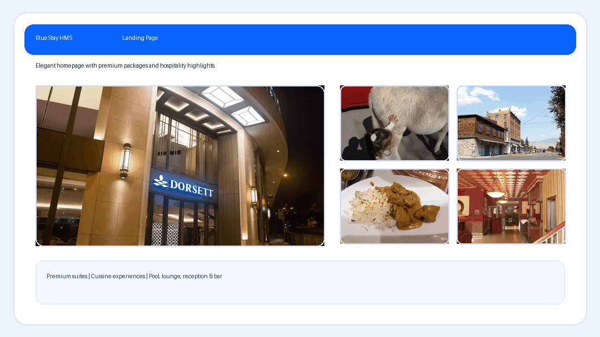

# BlueStay HMS

BlueStay HMS is a hotel management foundation built from your roadmap PDF.  
It includes public pages, auth, RBAC dashboards, APIs, invoice download, and SQL schema.

Live URL: **https://shirooni.free.nf/**
Android Release: **https://github.com/shiroonigami23-ui/hms-bluestay/releases/tag/v1.0.0**

## Tech
- PHP 8+
- MySQL/MariaDB (XAMPP friendly)
- Vanilla JS + responsive CSS

## Pages Included
- Landing (`index.php`)
- `about.php`
- `terms.php`
- `privacy.php`
- `help.php`
- `contact.php`
- `login.php`
- `register.php`
- `dashboard.php` (admin/staff/customer role-aware)

## API Endpoints
- `GET api.php?action=dashboard.stats`
- `GET api.php?action=auth.me`
- `GET api.php?action=users.list`
- `GET api.php?action=rooms.list`
- `POST api.php?action=rooms.create`
- `POST api.php?action=rooms.update`
- `POST api.php?action=rooms.delete`
- `POST api.php?action=rooms.updateStatus`
- `GET api.php?action=bookings.list`
- `GET api.php?action=bookings.get&id={id}`
- `POST api.php?action=bookings.create`
- `POST api.php?action=bookings.updateStatus`
- `POST api.php?action=bookings.checkin`
- `POST api.php?action=bookings.checkout`
- `GET api.php?action=tasks.list`
- `POST api.php?action=tasks.create`
- `POST api.php?action=tasks.updateStatus`
- `GET api.php?action=services.list`
- `POST api.php?action=services.create`
- `POST api.php?action=services.updateStatus`
- `GET api.php?action=invoices.list`
- `POST api.php?action=invoices.generate`
- `GET api.php?action=invoices.download&id={id}`
- `GET api.php?action=payments.list`
- `POST api.php?action=payments.create`
- `GET api.php?action=inventory.list`
- `POST api.php?action=inventory.create`
- `POST api.php?action=inventory.updateStock`
- `GET api.php?action=fnb.menu.list`
- `POST api.php?action=fnb.menu.create`
- `POST api.php?action=fnb.menu.updateAvailability`
- `GET api.php?action=security.visitors.list`
- `POST api.php?action=security.visitors.create`
- `POST api.php?action=security.visitors.checkout`
- `GET api.php?action=reports.summary`
- `GET api.php?action=reports.export`

## Local Run (XAMPP)
1. Copy project to `xampp/htdocs/HMS`
2. Copy `.env.example` to `.env`
3. Import SQL:
   - `database/schema.sql`
   - `database/seed.sql`
4. Start Apache + MySQL in XAMPP
5. Open `http://localhost/HMS/public`

Demo credentials (password for all): `Password@123`
- `owner@bluestay.local`
- `admin@bluestay.local`
- `reception@bluestay.local`
- `housekeeping@bluestay.local`
- `guest@bluestay.local`

## InfinityFree Deploy
1. Create DB in InfinityFree panel.
2. Update `.env` with InfinityFree host/user/pass/db name.
3. Upload project contents to `htdocs`.
4. Ensure `public/` is your web root or move `public` files into `htdocs`.

## APK / EXE Packaging Path
- APK: Capacitor or Android WebView wrapper.
- EXE: Electron or Tauri wrapper.
- Signing: `apksigner` (Android keystore) and Windows code-sign cert.

## Wikimedia Images
- Landing/About images are pulled from Wikimedia Commons and tracked in:
  - `public/assets/img/wiki_sources.txt`

## Security Hardening
- Session fixation mitigation (`session_regenerate_id` on login)
- CSRF protection on forms and all mutating APIs
- Rate limiting for login attempts (`auth_attempts` table)
- Strict CSP and security headers (PHP + `.htaccess`)
- Error/exception handling with safe client responses
- Audit trail support (`audit_logs` table)
- `.htaccess` hardening for production Apache hosts
- Auto DB bootstrap migration on first startup (fresh DB safety)
